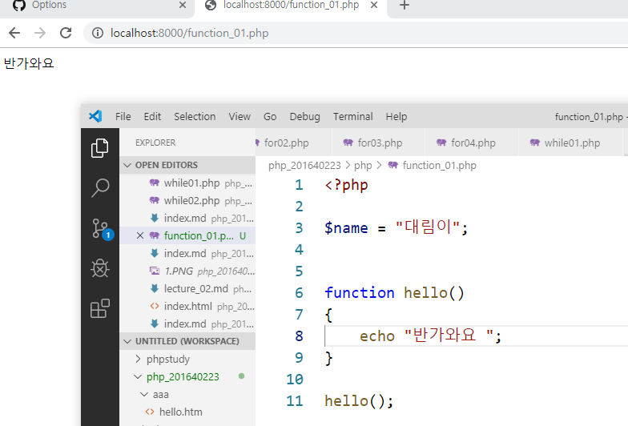

# 수업 2019.09.18
## 수업내용 정리

### docs 폴더 생성 index.md파일 생성 php_201640223폴더에서 터미널 실행
### git status 입력 새로생긴 docs가 빨간색으로 표현

워킹트리에만 올라가있던 docs를 git add를 해줌으로서 스테이징에 올려줌

git commit 과 git push 로 파일을 저장소에 올림

docs파일을 저장소에 올림으로서 master branch/docs folder 선택 가능

{: width="500"}
https://dudwns1013.github.io/php_201640223/ 를 들어가면 다음과 같이 나옴

{: width="500"}
index.md 파일 수정

git status로 수정된 index와 추가된 lecture들 확인
add . 으로 파일 스테이징에 추가 

commit과 push로 저장소에 올림

01폴더와 02 폴더를 생성 후 각각 lecture 파일을 넣어준뒤 lecture_01은 index로 파일명 변경
그리고 index 파일경로 수정

add commit push 로 파일 올리기

capture를 사용해 이미지를 올리기

{: width="500" height="500"}
올라간 이미지 확인

lecture_03을 03폴더에 index.html 로 변경 후 내용 html 양식으로 수정

{: width="600" height="600"}
{: width="600" height="600"}
lecture_04를 04 폴더에 index.md 로 변경

04폴더에 01.md 생성 후 docs에 index.md 파일에서 목록을 표기해주는 * 을 사용

{: width="600" height="600"}
php 폴더에 function_01.php 생성후 내용 기입후 터미널에서 php 폴더로 들어가고
function_01 파일 출력 후 서버 실행

$로 변수를 선언하고 사용

function으로 함수 생성 사용

함수가 존재하는지 조건문에 function_exist로 조건을 줌

function_02 생성 후 내용 입력

내용 수정 후 출력확인

함수에 인자를 변수로 넣을수있음

함수에 int형으로 값 두개를 추가로 받게 해주고 a와b를 더한 값을 sum에 넣어주어 함수에 반환해줌

{: width="600" height="600"}
소스트리설치

{: width="600" height="600"}
스테이지에 올리면 git add 와 같음

{: width="600" height="600"}
소스트리로 커밋 및 푸시

docs아래에 새폴더 _layouts생성후 default.html파일 생성후 코딩

{: width="600" height="600"}
소스트리로 푸시

{: width="600" height="600"}
default가 적용된 홈페이지

{: width="600" height="600"}
2주차에 했던 theme 폴더에 index파일에서 붙스트랩과 자바스크립트 코드를 복사 붙여넣기
/는 도메인을 가리킴, /없다면 현재폴더위치를 가리킴으로 현재 맞지않음 수정

{: width="600" height="600"}
push된 후 화면 확인 - 변화 없음

{: width="600" height="600"}
getbootstrap에서 css와 js 코드를 복사

{: width="600" height="600"}
default.html에 적용

{: width="600" height="600"}
붙스트랩 components> jumbotron

{: width="600" height="600"}
jumbotron 코드를 메인페이지 코드에 추가 적용

{: width="600" height="600"}
{: width="600" height="600"}
grid와 listgroup 코드 복사

{: width="600" height="600"}
layout의 grid와 components에 list group을 받아와 index 코드 수정 후 확장자 md가 아닌 html로 변경

{: width="600" height="600"}
html 태그 적용

{: width="600" height="600"}
function_03.php 파일 만들고 코딩(가변함수 사용)

{: width="600" height="600"}
function_04.php 파일 만들고 함수를 조건문에 따라 출력되게 코딩

변수 lang이 en 일때

function_05.php 파일 만들고 변수에 함수 넣는 가변함수

function_05.js 파일 만들고 console로 출력되게 코딩 후 bash 에서 확인

가변함수 예제

순서에 영향을 받음

function_06.php 파일 만들고 switch예제 코딩 break 가없어 전부 출력

break 사용 후

switch에서 해당되는 함수를 불러오기

함수에 상태패턴 적용

재귀함수 예제

재귀함수 사용시에는 무한루프를 주의해야하므로 조건으로 빠져나올수 있게해주어야함

function_08 파일 만들고 확인
