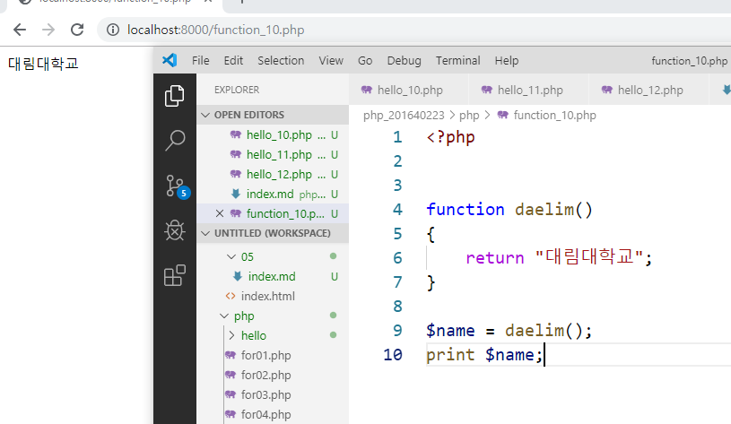
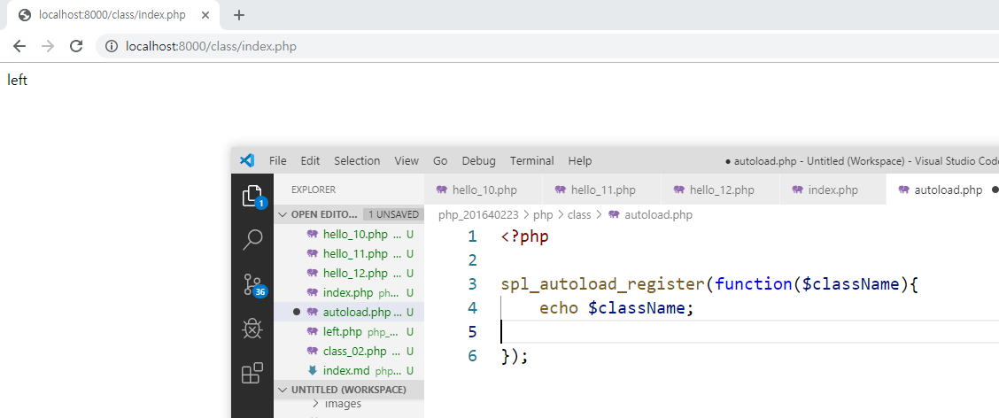

# 수업 2019.09.25
## 수업내용 정리

##### hello_10.php 파일 생성 후 출력하는 echo와 print사용 및 줄바꾸기 \n사용

##### hello_11.php 파일 생성 후 다른파일을 포함 시키는 include 사용

##### php -S localhost:8000 -t ./php를 이용해 php_201640223에서 실행했지만 php 폴더에서 서버가 실행됨

##### 없는 파일을 include 했더니 콘솔창에 에러가 나오지만 계속 실행함

##### require 는 없는 파일을 실행하면 에러가 뜨고 실행이 중단됨

##### hello_12.php 파일 생성 후 페이지 정상 출력, 콘솔 에러 없음

##### hello_12.php 파일을 php 폴더 안에 새로 생성한 hello 폴더에 넣고 실행하자
##### 페이지에 hello_12내용을 출력하지 못하고 콘솔창에 에러가 출력
##### 파일이 같은 폴더경로에 있지 않으면 읽어오짐 못함

##### 파일경로까지 입력해주자 정상작동

##### hello_10.php 파일을 php 상위폴더로 빼주고 ../ 로 상위폴더 경로를 표현

##### function_10.php 파일 생성 후 함수 코드 입력 후 페이지 정상 확인

##### return은 반환값을 주는 것으로 변수에 함수를 넣어주고 출력

##### print 나 echo 는 배열을 출력하지 못함

##### print_r로 배열 출력
##### 배열을 인덱스로 한개 한개 출력 해줌

##### 리스트를 이용해 변수에 배열 값을 넣을수있음

##### 함수의 반환형을 다르게 하면 에러남

##### function_11.php 파일을 생성후 function_10의 함수부분만 옮겨주고
##### include로 파일을 연결해도 정상 작동

##### include를 두번하면 같은 함수가 두번 불러와져 에러가뜸
##### include_once 를 사용하면 중복되도 한번만 가져오므로 정상 작동

##### 함수가 존재하는지 검사하는 function_exists를 이용해 없으면 함수를 생성하고
##### 있으면 문자열 출력 이것을 include_once가 아닌 include 를 사용하면
##### 첫번째 include 는 함수가 없으므로 함수를 생성해주고 두번째 include 는
##### 함수가 생겼으므로 문자열 출력

##### class 폴더 생성 후 index.php 파일 생성

##### class_01.php와 class_02.php 생성 후 클래스는 다르지만 같은 함수를 가지게 코딩
##### class 는 함수보다 큰단위

##### 함수가 같으므로 페이지에러

##### class 를 인스턴스화 해서 변수에 저장

##### 클래스는 변수 함수 여러개 보유가능

#####  상수는 :: 로 가져옴

#####  클래스명 가져오기

##### autoload에서 조건문으로 파일이름 반환

##### 자기자신을 가리키는 this 사용

##### this로 자기 자신을 계속 리턴해서 메소드 체인을 사용

##### 파일을 만들고 class에서 정적으로 static을 이용해서 변수를 
##### 생성 했으므로 index에서 출력할때 $를 써줘야한다

##### 인스턴스를 생성하면 this 인스턴스를 생성하지 않으면 self를 사용

##### index2.php 파일을 생성 후 클래스를 만들고 내용 코딩
##### 메서드와 변수를 만들어주고 메서드 체인 사용

##### index3.php 생성 후 클래스생성 php 는 클래스를만들면 __construct메소드가자동으로생긴다

##### __CLASS__ 로 클래스명 가져오기

##### hello 메서드 추가생성후 호출로 출력

##### this로 호출

##### 접근제한자 private 예제 private 는 같은 클래스 내에서만 접근가능

##### extends 로 daelim 클래스를 상속받아서 daelim 클래스의 메소드를 사용가능

##### 클래스를 상속받아 메소드를 가져오는 것을 오버라이딩이라고 하는데

##### final을 사용해 상속받지 못하게 할 수 있음

##### 인터페이스인 greeting 를 받아옴 greeting 은 클래스의 틀이 되므로

##### greeting의 메소드를 daelim 클래스에서 사용하지 않으면 에러

##### 추상클래스를 상속받아 사용 인터페이스와 달리 자유로움

##### trait 는 혼자 사용불가하고 클래스에 삽입해서 사용해서 쓸 수 있다.
##### 상속으로 불필요한 부분까지 가져오지 않기 위해 trait을 사용한다.

##### 가상의 공간인 namespace 생성

##### 클래스 aaa가 namespace인 uclid 에 속하게 되므로 호출하려면 uclid로 해야한다.

##### namespace 를 지정한 파일을 편하게 부르기 위해 use를 사용한다.

##### as 로 namespace의 경로를 줄여쓸 수 있다.

##### 전역변수와 지역변수의 차이를 알 수 있다.

##### global 을사용하면 외부의 변수를 가져올수있음

##### function 안에서 global로 선언해서 a가 5를 받아오고 뒤에 a에 6을 넣고 

##### 함수 밖에 전역변수 a에도 6이 들어가진다

##### 배열을 이용하는 슈퍼변수 GLOBALS를 쓸 수 있다.

##### 서버 주소를 가져오는 슈퍼변수 $_SERVER