# 수업 2019.10.02
## 수업내용 정리

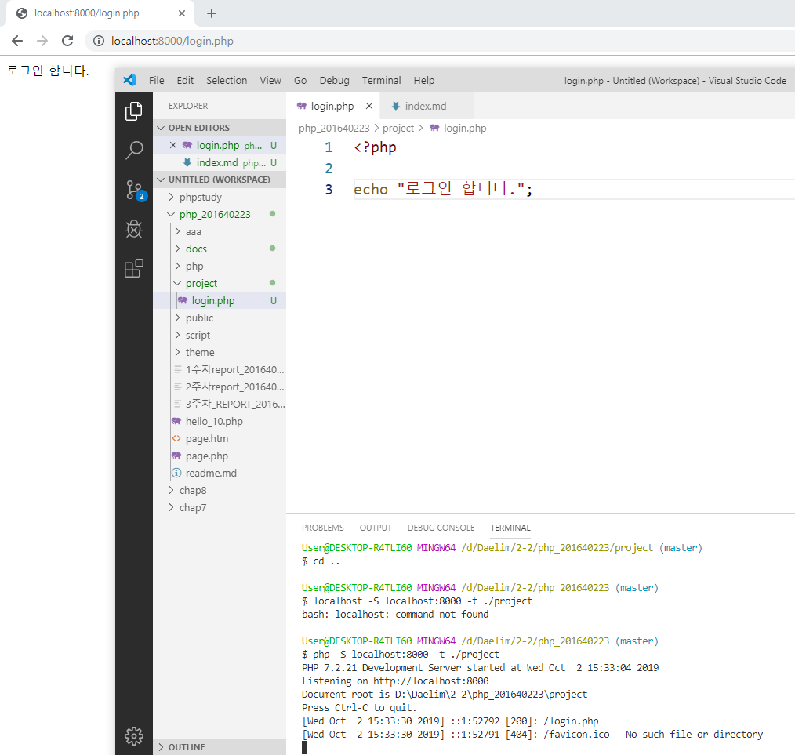
##### 프로젝트 폴더와 login.php 파일 생성 후 파일에 내용을 코딩해준 후 서버를
##### 실행해 웹에서 결과 확인 

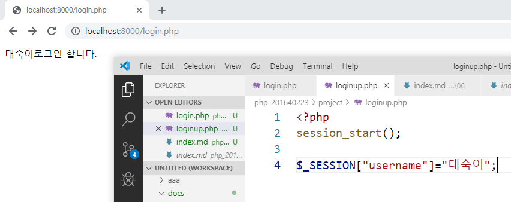
##### 세션을 쓰기위해 session_start(); 를 사용
##### loginup.php 파일을 만들고 username에 대숙이를 넣어줌
##### 웹에서 login.php 에서 변화가 없으나 loginup.php를 접속한 뒤에
##### 다시 login.php 에 접속하면 세션에 남은 username 값을 가져와 출력해줌

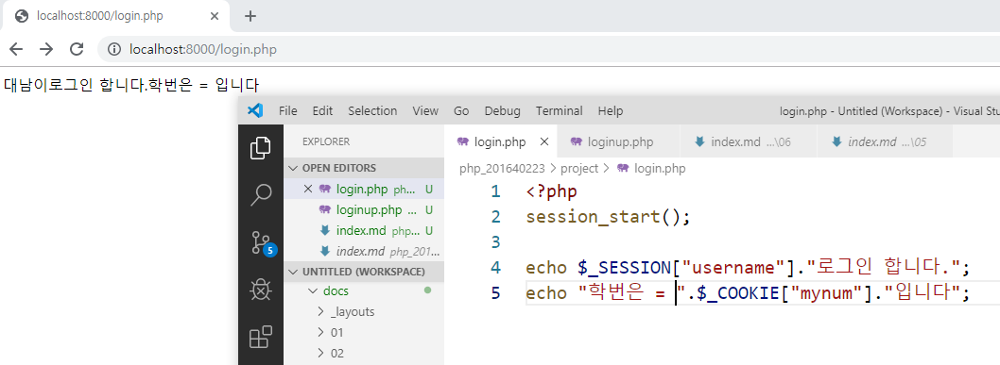
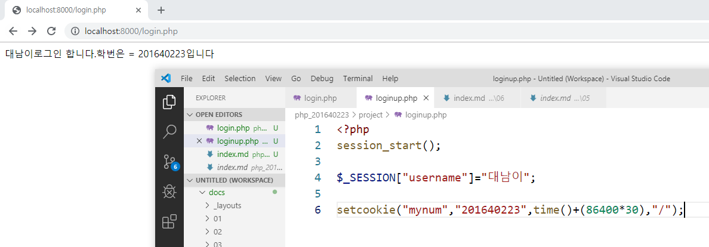
##### loginup에서 쿠키에 데이터와 유지시간 위치 정보를 넣어줌
##### login에서 데이터가 없어 값이 출력되지 않음
##### loginup을 갔다오자 loginup에 있는 데이터를 가져와 학번이 생김

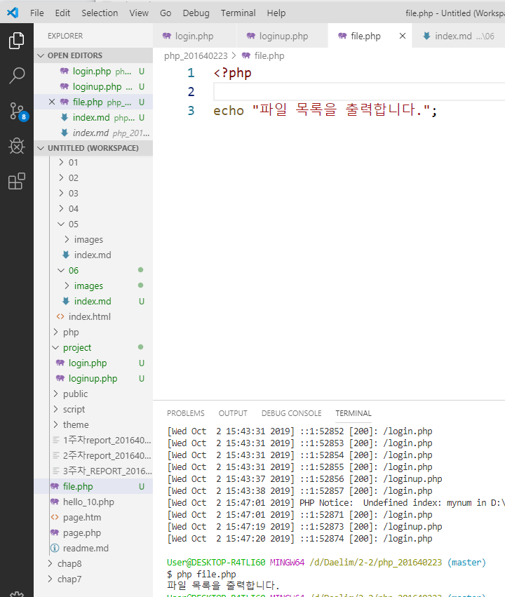
##### 학번 폴더에 file.php 를 생성 후 명령 창에서 파일 실행

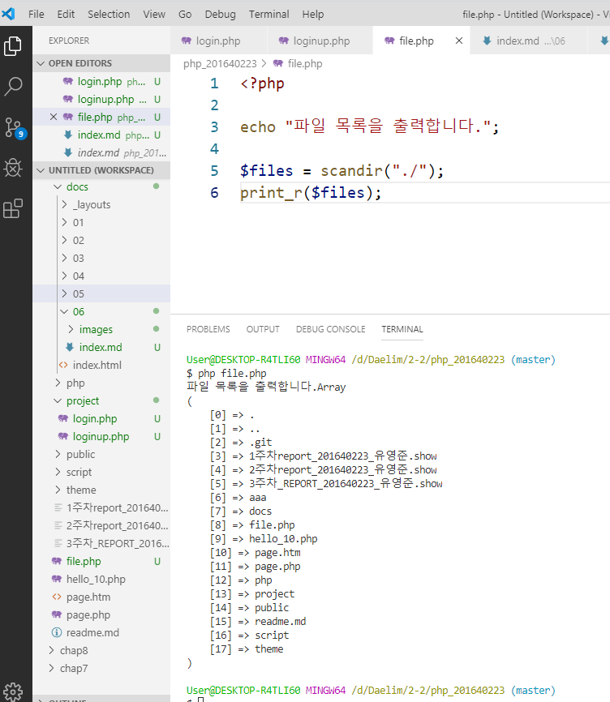
##### scandir을 이용해 파일 목록을 배열로 받아옴
##### print_r 로 출력해 확인

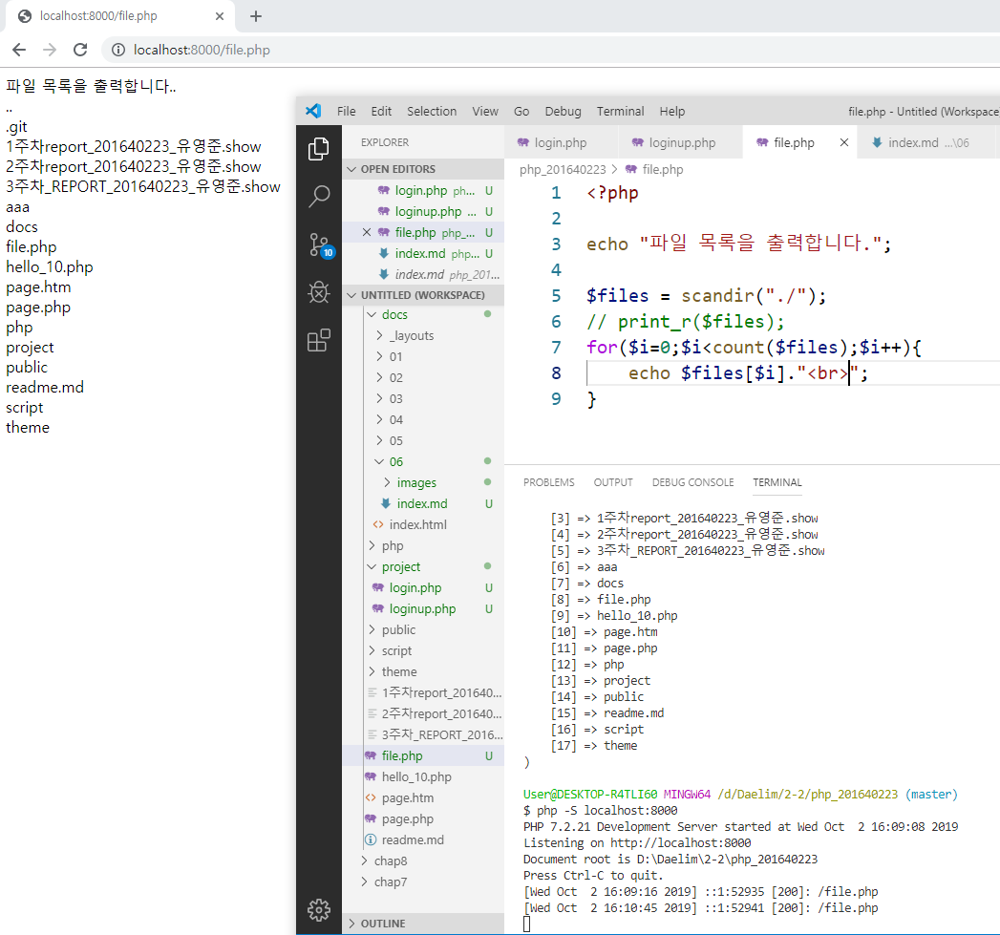
##### 서버를 실행하고 웹에서 보기 좋게 하기 위해
##### for 반복문을 이용해 $files 출력

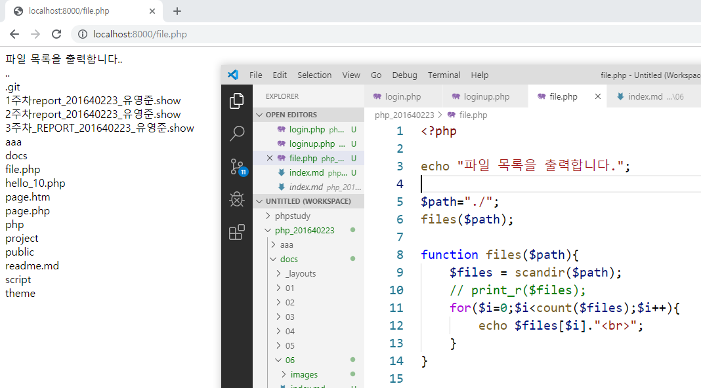
##### for문을 함수에 넣어주고 전역변수 $path를 만들어서 경로값을 넣어줌

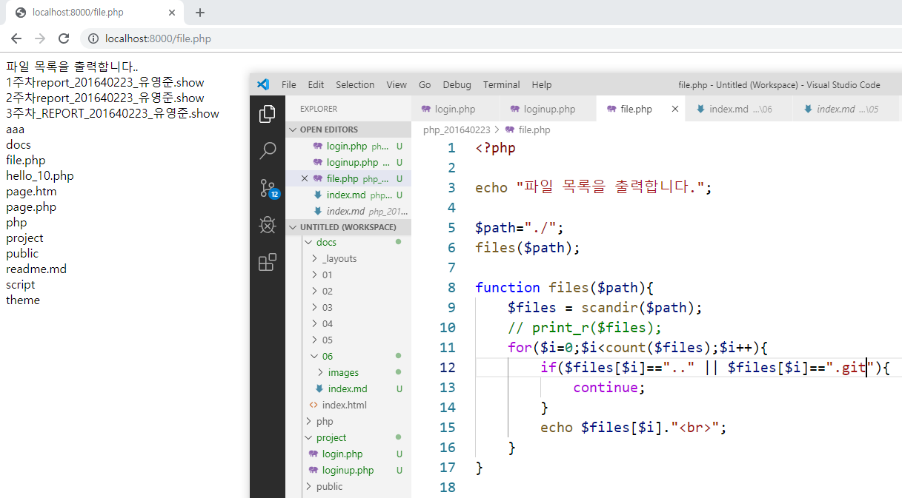
##### for문 안에 if문으로 조건을 줘서 .. 과 .git 이라는 이름을 가진 것을
##### continue를 이용해 출력되지 않게 함

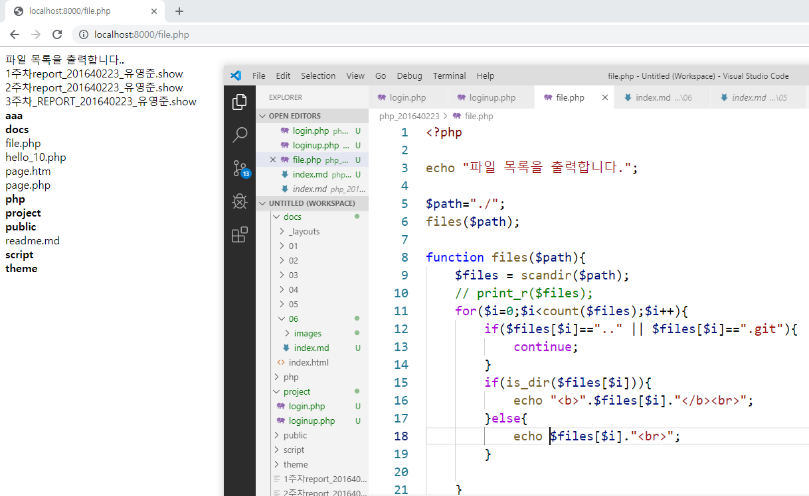
##### is_dir로 검사해서 디렉토리들만 굵게 표시함

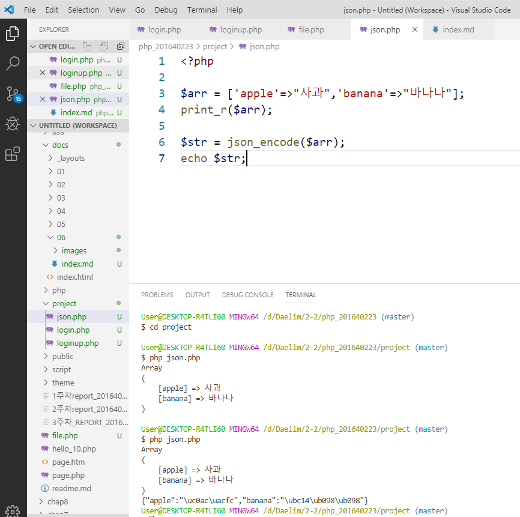
##### json.php 생성 후 배열을 가지는 변수를 만들어주고
##### json으로 바꿔주는 json_encode를 사용한 후 출력 확인
##### 자바스크립트가 json 문자열을 받아 사용한다.