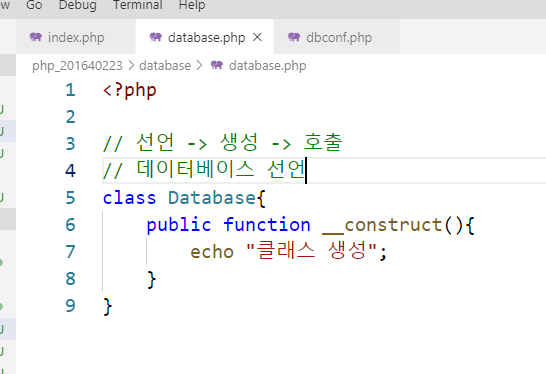
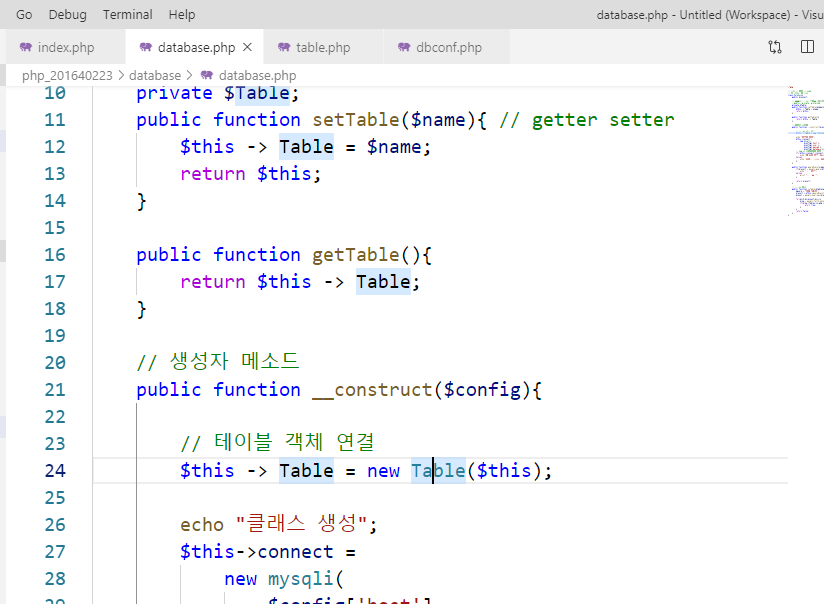
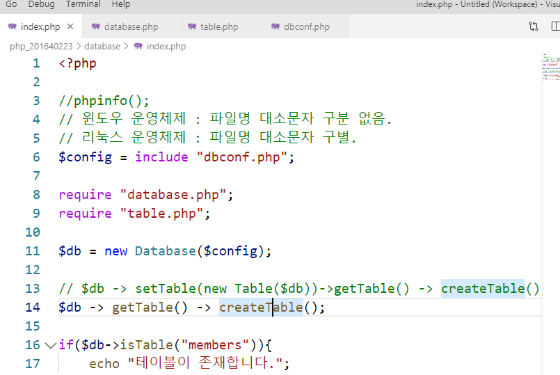
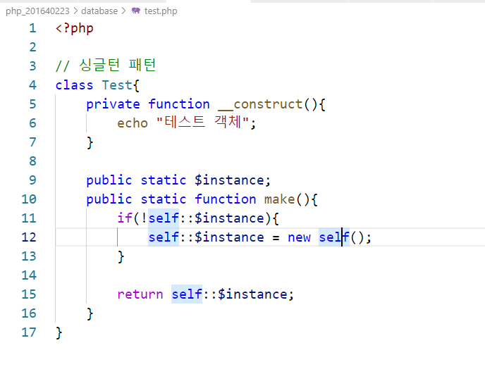

# 수업 2019.10.23
## 수업내용 정리

##### cmd에서 mysql실행 후 데이터베이스 확인
##### -------------------------------------------------------------------------------------------------------------------------------------   

##### php라는 데이터베이스 생성 후 확인
##### ------------------------------------------------------------------------------------------------------------------------------------- 

##### 학번 폴더에 database 폴더 생성 후 index.php 파일 코딩 후 실행
##### -------------------------------------------------------------------------------------------------------------------------------------   

##### mysqli와 pdo 사용을 위해 php.ini 파일을 수정 
##### ------------------------------------------------------------------------------------------------------------------------------------- 

##### index.php 를 mysql에 접속하도록 코딩해준 후 확인
##### -------------------------------------------------------------------------------------------------------------------------------------  

##### dpconf.php 생성 후 서버생성 변수들을 옮겨주고 include로 연결
##### -------------------------------------------------------------------------------------------------------------------------------------  

##### 코드가 끝나면 데이터베이스가 종료되도록 해줌
##### -------------------------------------------------------------------------------------------------------------------------------------   

##### 프로퍼티 connect_errno를 사용(주석에 있듯이 에러가 없으면 0)
##### -------------------------------------------------------------------------------------------------------------------------------------   

##### database를 사용하기 위해 use php;
##### 데이터베이스에 table을 확인하기 위해 show tables;
##### -------------------------------------------------------------------------------------------------------------------------------------    

##### members 테이블을 생성하고 변수 query에 저장
##### if를 사용해 데이터베이스에 query 테이블을 넣어줌  
##### 만약 새로고침을 하면 실패로 나옴 이유는 이미 테이블이 생성되어 있기에 동일한 이름의 테이블 생성 불가
##### -------------------------------------------------------------------------------------------------------------------------------------   

##### database.php 생성 후 클래스 선언
##### index에서 기존에 있던 코드를 주석처리해주고 require로 database를 가져와서 클래스를 생성해줌
##### -------------------------------------------------------------------------------------------------------------------------------------  

##### connect 객체에 데이터베이스를 생성하는 객체를 넣어줌
##### 이전에 사용했던 errno를 사용해 DB접속 확인
##### index에서 생성해준 클래스에도 생성자와 같이 인자를 넣어줌
##### ------------------------------------------------------------------------------------------------------------------------------------- 

##### 가변변수를 이용해 순서상관없이 값을 이용 할 수 있음
##### -------------------------------------------------------------------------------------------------------------------------------------    

##### dbconf.php에 값을 한개만 반환해주는 return을 사용해서 원래 config에 있던 것을 넣어줌
##### 그리고 include로 $config에 넣어줌
##### -------------------------------------------------------------------------------------------------------------------------------------  

##### database.php 에서 쿼리를 데이터베이스와 연결하는 메소드 queryExecute를 선언해준다.
#####  mysqli_num_rows로 테이블 갯수를 체크하고 테이블 이름을 mysqli_num_rows로 반환받음
##### -------------------------------------------------------------------------------------------------------------------------------------  

##### database.php에서 isTable 메소드 생성 후 index.php의 코드 옮겨줌
##### 코드를 옮겨주므로 $db를 현재 database.php이므로 $this로 바꿔줌
##### -------------------------------------------------------------------------------------------------------------------------------------    

##### index.php에서 database.php 클래스에 있는 isTable메소드를 가져와 members 테이블이 존재하는지 확인
##### -------------------------------------------------------------------------------------------------------------------------------------    

##### table.php 생성 후 클래스 선언 및 생성자 선언
##### -------------------------------------------------------------------------------------------------------------------------------------    

##### database.php에서 복합객체 $Table 선언, 변수는 대소문자 구분
##### -------------------------------------------------------------------------------------------------------------------------------------    

##### 변수 Table의 접근제한자를 private로 바꿔주고, setter 와 getter 메소드를 선언
##### -------------------------------------------------------------------------------------------------------------------------------------    

##### index.php에서 Table 객체를 생성해서 setTable 메소드로 연결해줌
##### -------------------------------------------------------------------------------------------------------------------------------------
    

##### table.php에서 creatTable메소드를 사용해 테이블 생성
##### -------------------------------------------------------------------------------------------------------------------------------------
    

##### setTable로 연결한 것을 getTable로 읽어옴
##### -------------------------------------------------------------------------------------------------------------------------------------
    

##### setTable에서 return을 해주고 index.php에서 메소드체인 방식사용
##### -------------------------------------------------------------------------------------------------------------------------------------    

##### table.php에서 변수 Database를 선언, 생성자에 인자를 넣고 변수 Database와 연결
##### -------------------------------------------------------------------------------------------------------------------------------------    

##### setTable에서 table.php에 Table클래스 생성자에 인자값을 database클래스 생성자인 $db를 넣어 

##### Table클래스와 연결
##### -------------------------------------------------------------------------------------------------------------------------------------
    

##### 아까 복사해준 코드 query에서 members1로 테이블이름을 바꿔주고, mysqli_query함수로 

##### 데이터베이스와 연결해 테이블 생성
##### -------------------------------------------------------------------------------------------------------------------------------------
    

##### cmd-> mysql에서 members1 테이블 생성 확인 
##### -------------------------------------------------------------------------------------------------------------------------------------    

#####  Database 클래스 생성자에서 Table 클래스를 연결해줌
##### -------------------------------------------------------------------------------------------------------------------------------------
    

##### Database 생성자에서 Table클래스를 연결했으므로 setTable을 생략
##### -------------------------------------------------------------------------------------------------------------------------------------
    

##### createTable메소드에 인자값을 넣어주고 그 인자를 테이블 이름에 넣어줌
##### -------------------------------------------------------------------------------------------------------------------------------------
    

##### index에서 인자값을 member2로 줌
##### -------------------------------------------------------------------------------------------------------------------------------------
    

##### cmd mysql에서 테이블 확인
##### -------------------------------------------------------------------------------------------------------------------------------------
    

##### 인자값에 배열을 추가해주고, 중간에 LastName과 FirstName을 주석처리해주고 .= 을 이용해 쿼리의

##### 앞뒤 부분을 연결해줄수 있고, foreach로 $fields 배열에 있는 키와 값을 분리해 query에 넣어줌
##### -------------------------------------------------------------------------------------------------------------------------------------
    

##### createTable메소드의 인자값에 $fields자리에 들어갈 배열을 넣어줌
##### -------------------------------------------------------------------------------------------------------------------------------------
    

##### cmd mysql에 테이블 확인
##### -------------------------------------------------------------------------------------------------------------------------------------
    

##### test.php 파일을 만들고 클래스와 생성자 메소드를 선언

##### index2.php 파일을 만들고 include로 test.php파일을 연결

##### $obj 에 클래스 Test 를 생성해줌
##### -------------------------------------------------------------------------------------------------------------------------------------    

##### 생성자의 접근제한자를 private로 바꿔주고

##### 정적으로 변수$instance를 선언, 메소드 make도 선언

##### static이므로 this사용불가하므로 self를 사용
##### -------------------------------------------------------------------------------------------------------------------------------------    

##### 만약 test.php에서 if로 메소드 검사를 하지 않는다면 3번 출력되지만

##### 검사를 했으므로 똑같은 obj1 , obj2, obj3 이 다 출력되지 않고
##### 한 번만 출력됨
##### -------------------------------------------------------------------------------------------------------------------------------------    

##### 팩토리, 전력 패턴 연습 코드
##### -------------------------------------------------------------------------------------------------------------------------------------
    