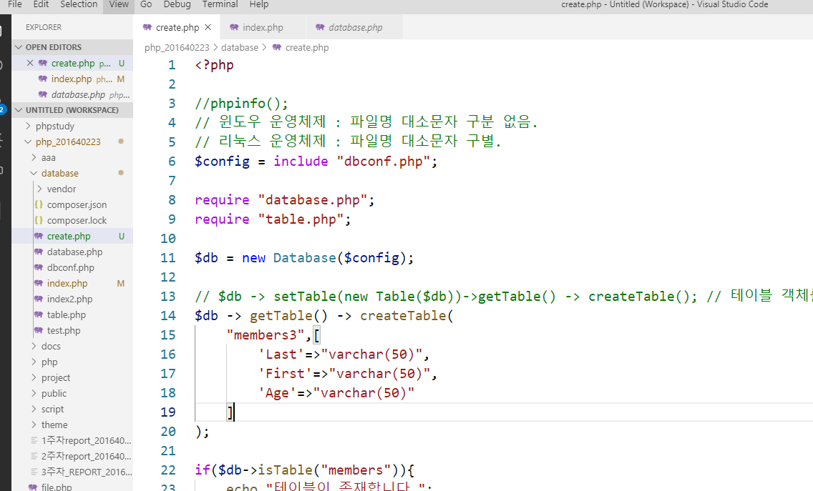
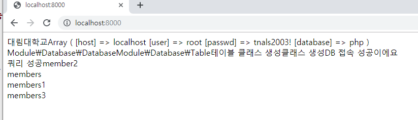
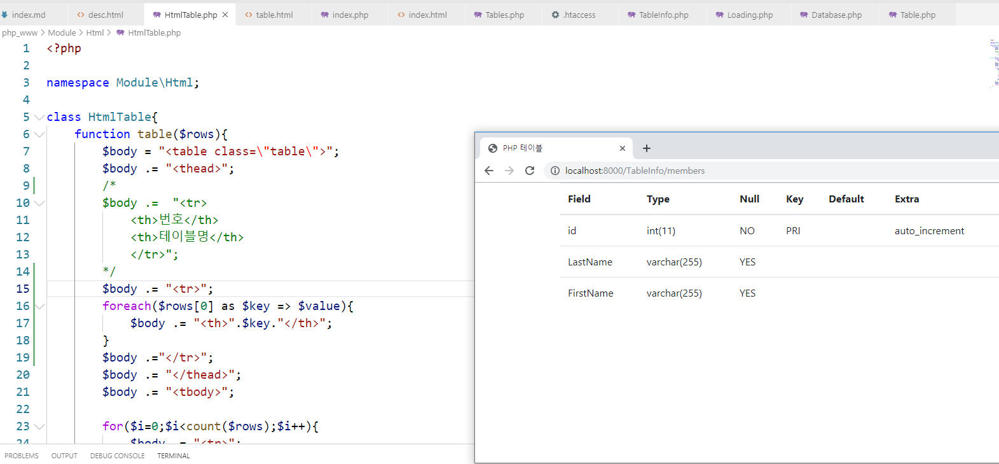

# 수업 2019.10.30
## 수업내용 정리

##### database 폴더에 있던 index파일을 create로 이름을 바꿔주고 새로 index.php 생성
    

##### 원래 index의 클래스를 가져와 사용
  

##### 새로 작업할 폴더 php_www 생성 및 README.md 생성
    

##### 새로운 폴더를 git과 연결하는 과정
    

##### github에 새로 만들어둔 저장소에 연결 후 파일 업로드
    

##### php_www에 public 폴더를 만들고 index.php 파일 생성 후 터미널에서 public폴더로 서버를 오픈
    

##### add, commit, push 로 파일을 올리고 github에서 확인
    

##### Module 폴더와 그 안에 Database 폴더 생성 후 database.php와 table.php 를 가져와 첫 글자만 대문자로 바꿔줌
##### dbconf.php도 가져옴
       

##### index에 상위 폴더에 파일을 가져오는 코드를 넣고 확인
    

##### index에 학번 폴더에 있던 query를 사용하는 index코드를 가져와 폴더 경로만 수정 후 확인
    

##### 터미널에서 git add, commit, push로 파일 업로드
    

##### Loading.php 생성 후 자동으로 require 해주는 기능인 spl_autoload_register를 사용
    

##### 원래 있던 require 을 주석처리하고 Loading 파일을 require 해준 후 확인
    

##### Database와 Table 파일에 namespace 생성 후 인덱스 파일에서 사용해서 namespace 이름을 로딩해와서 출력

##### Database 파일에서 \ 로 전역 namespace화 해주고 네임스페이스들을 정해준 뒤 파일경로 수정
    

##### table.html 파일 생성 후 bootstrap4 를 가져와 css와 js, table에 관한 소스를 넣어줌
    

##### file_get_contents로 파일을 읽어오고 str_replace로 데이터 치환해서 html과 연결
##### for문을 사용해 가져온 테이블 소스 틀에 맞게 코딩
   

##### table.html에서 body 부분의 table 태그 제거 후 {{content}}만 남겨둠
    

##### index.php 에서 원래 for문 안에 있던 태그 들을 주석처리 해주고 rows 배열 변수 추가
##### 함수 table을 생성해 변수 rows를 인자로 갖고 body 변수에 태그와 내용들을 문자열로 받아 넣어 테이블을 생성
   

##### HtmlTable 파일 생성 후 index에 있던 테이블태그 코드 옮겨줌
    

##### index에서 HtmlTable을 네임스페이스로 생성(Loading.php를 통해 자동으로 require 해옴)
##### content 변수에서 테이블 함수를 생성한 html변수 연결해 사용 

##### Tables.php 생성 후 index에 있던 내용 옮겨주고 네임스페이스 설정
    

##### index에서 TableInfo클래스를 가져와 생성 후 main메서드 실행

    

##### .htaccess파일을 가져와 리라이트 엔진을 활성화 시킨 후 슈퍼변수를 사용해 주소값에 입력된 값을 출력
    

##### 슈퍼변수값을 uri 변수에 넣어주고 explode를 사용해 그 변수의 주소값을 찾아 uris 변수에 다시 넣어주고 배열로 출력 

    

##### if를 사용해 입력된 것이 없다면 else로 무언가 있다면 어떤 컨트롤러 실행을 출력

    

##### index.html 파일 생성 후 table.html에 있는 소스를 옮겨줌

    

##### 부트스트랩4에서 jumbotron 코드를 복사해 index.html에 {{content}} 를 빼고 넣어줌
    

##### jumbotron 적용 확인

    

##### 데이터베이스와 연결이 이상해져서 컨트롤러 분리를 위해 db변수에 데이터베이스 클래스를 연결해주고

##### 테이블이 db를 거쳐가도록 작성

    

##### 테이블이 거쳐가도록 위에서 적은것처럼 생성자 인자에 db 변수를 만들어주고

##### 전역변수로도 db로 만들어준뒤 전역변수에 지역변수가 들어오도록 설정

##### result도 db코드가 index로 갔으므로 생성한 전역변수 db를 거쳐가도록 해야 정상적으로 작동함

   

    

##### {{content}}를 class가 container인 div안에 넣어줘서 중앙으로 오게해줌

    

##### index.html에서 버튼의 경로와 글자를 바꿔줌

    

##### Tableinfo에서 데이터베이스에 값을 줄별로 받아옴

    

##### mysqli_fetch_object를 사용해 $row에 쿼리 정보를 넣어주고 배열 문자열로 출력

    

##### foreach를 사용해 깔끔하게 출력되도록 해줌

    

##### 주석에서 설명하듯이 연상 배열로 Tables.php 의 코드를 수정

    

##### foreach문을 사용해 key와 value로 연상배열 형태로 줄여서 작업
    

##### members 테이블의 값을 2차원 배열로 받음

    

##### 값 제목 부분을 임의로 써준게 아닌 실제 테이블의 이름 값인 키값을 foreach로 0번째 줄인 제목 부분에 넣어줌 

