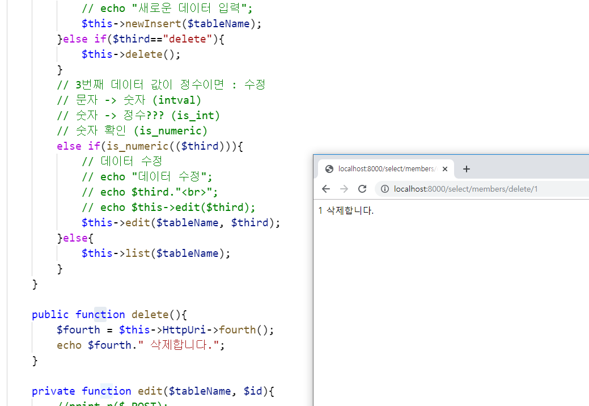
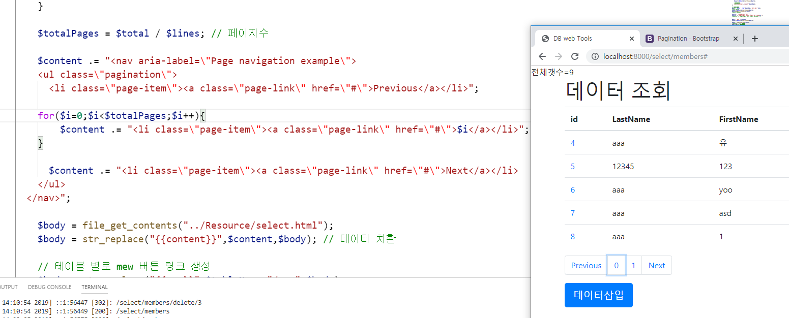
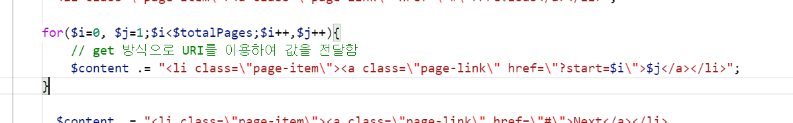

# 수업 2019.11.13
## 수업내용 정리

##### update로 데이터를 수정 할 수 있는데 위와 같이 수정하고자하는 열의 이름을 선택하여 바꿔줄 수 있다.

  

##### 하지만 id로 혹은 특정하게 지정하주지 않으면 값이 전부 바뀌게 되므로 위와 같이 id 등 무언가를

##### 지정해 주어 원하는 특정 값만 수정해 줄 수 있어야 한다.

  

##### 원래 있던 main 함수 if 문 중간에 else if를 추가하여 조건으로 세번째 주소값에 값이 있으면 echo로 

##### 데이터를 출력하도록 한다.

  

##### 같은 메소드체인을 호출하는 것보다 변수에 저장을 해주어 부르는 것이 더 간편화되므로 $third에 

##### 세번째 주소값을 저장

#####  else if의 조건에 is_numeric을 주어 숫자인지 판별한다.

  

##### 인자값을 $id 로 받는 메서드 edit을 생성 후 메인문에 if 안에서 호출하는데 인자값에

##### 세번째 주소값인 $third를 준다.

  

##### insert.html파일을 복사해 edit.html 파일을 만들어주고 select.php파일 내에서 코드를

##### 복사해와서 edit.html을 edit 메소드에 연결해준다.

  

##### 파일내에서 $content 내용을 복사해 오고 인자값에 $tableName을 추가해준다.

  

##### main 메서드에서도 edit에 인자값을 1개에서 2개로 바꿔주어 다음과 같이 출력됨을 확인한다.

  

##### $query에 테이블 전체에서 id값으로 데이터를 찾는 문을 넣어주고 잘나오는지 출력해본다.

  

##### $result와 $orw를 받아와 print_r로 출력해서 확인해본다.

  

##### 변수이름이 row 가 겹쳐서 충돌이 나므로 위에서 data로 바꿔주고 $content의 키와 값을 수정해주면

#####  다음과 같이 나온다.

  

##### 수정이 잘되는지 print_r로 데이터를 확인

  

##### 수정 버튼 클릭시 리스트로 페이지가 이동되도록 하는 header 사용

  

##### 페이지가 이동되는 것을 확인

  

##### 데이터를 수정하면 바로 값이 수정되면서 페이지를 리스트로 가도록 코딩

  

##### 수정이 잘 된것을 확인

  

##### id값에 링크를 주어 바로 수정화면으로 가도록 해줌
  

##### id를 이용한 삭제 버튼 추가

  

##### delete 메서드를 생성해주고 main 메서드에서 else if를 추가해 메서드 연결

  

##### Uri.php에 4번째 주소값을 찾아 반환하는 fourth 메서드 생성

  

##### delete메서드에 fourth메서드를 연결해주고 변수로 만들어 준 뒤 4번째 주소값에 들어간 id값을 출력

  

#####  id 가 1,2,3 인 삭제된 데이터 확인

  

##### 부트스트랩에서 페이지 이전 갯수 다음 을 보여주는 소스 가져와서 적용

  

##### id의 갯수를 찾는 $total 변수를 출력

  

##### LIMIT를 사용해 $start부터 $lines 만큼 보여주게 한다.

  

##### 받아왔던 부트스트랩 코드를  for문을 이용해 수정해서 자동으로 갯수만큼 페이지가 생성되게 한다.

  

##### for문 조건에 변수를 두개 넣어주는데 실질적으로 작용하는것은 i이고 j는 표기용으로 사용된다.
  

##### uri를 ?start=$i 로 지정해 준다.

  

##### Uri.php에서 변수 $uri를 explode를 사용해 ?로 구분을 짓도록 해준다. 

  

##### $start에 $lines를 곱한것을 다시 넣어줌으로써 5칸씩 나올수 있게 해주고 get방식을 사용해

#####  start가 존재하면 그대로 진행하고 아니면 0을 주게한다.

  

##### start가 1, 2 즉 1페이지 2페지가 각각 값이 5개씩 들어가는 것을 볼 수 있다.
  

##### bootstrap4에서 formgrid를 가져와 name을 만들어 주고 placeholder를 수정해준다.

  

##### 마찬가지로 bootstrap4에서 가져온 코드를 사용하는데 col-sm-숫자는 범위를 의미한다.

  

##### class에 컨테이너뒤에 fluid를 붙여주면 창을 가득채우며 범위를 나눈다.

  

##### col-sm-2의 범위를 보기 위해 좌측 메뉴를 적어줌

  

##### bootstrap4에서 list-group으로 좌측 메뉴의 이름과 경로를 수정해준다.

  

##### select.html에도 수정한 list-group을 적용해준다.

  

##### 네비게이션코드를 startbootstrap에서 받은 템플릿의 index.html에서 가져와 적용시킨 후
##### 네비게이션바와 기존 코드가 겹쳤던 부분을 css 파일에서 패딩코드를 가져와 적용해줌
  

##### table.html과 같이 desc.html에도 패딩, 네비게이션, list를 적용해 줌.

  

##### Tables.php 파일에서 select.php 를 읽어오는 data라는 열을 만들어준다.

  