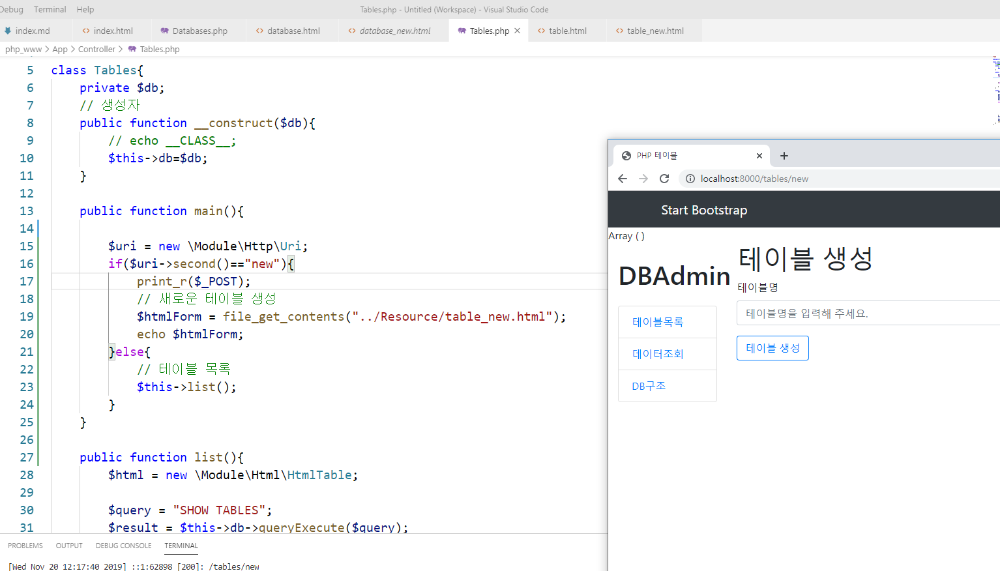

# 수업 2019.11.20
## 수업내용 정리

##### bootstrap4에서 form에 있는 이메일로 로그인하는 코드를 가져와 index.html form 있던 자리에 붙여 넣어줌

#####  

##### Login.php를 생성해 생성자와 메인 메소드를 만들어줌

#####  

##### index.html에서 name에 email과 password를 넣어 안넘어가던 값을 넘어가게 해줌

#####  

##### 이메일과 비밀번호를 관리자 계정으로 지정해준 변수와 비교하여 로그인 확인

#####  

##### 세션을 켜줌

#####  

##### 세션에 email 값을 넣어줌

#####  

##### 세션값을 확인해서 로그인 상태 확인

#####  

##### index.html의 form부분만 새로 생성한 login.html로 옮겨줌

#####  

##### form이 있던 부분에 머시태그를 넣어줌

#####  

##### index.php에서 머시태그를 로그인 되어있으면 로그인상태로 바꿔주고 안되어있으면 로그인 해주세요 코드 생성

#####  

##### login.php코드를 복사하여 logout.php 를 만들고 아래 코드는 다 지워준뒤

#####  세션을 비워줌

#####  

##### 로그인 되었을때 머시태그를 경로를 가진 로그아웃으로 바뀌게 해줌

#####  loginform변수를 만들어 login.html을 읽어오게 하고 머시태그를 변수 loginform으로 바꿔줌

#####  

##### 로그인되면 databses로 가게 경로 설정 실패하면 메인으로

#####  

##### 로그아웃하면 메인으로

#####  

##### bootstrap4에서 코드를 가져와 디자인 있는 버튼을 생성

#####  

##### 버튼에 id값을 주고 id로 버튼을 찾아 스크립트를 넣어 버튼을 클릭하면 경고창으로 글이 출력되게 함

#####  

##### 경로를 설정해줘서 버튼을 클릭하면 정해진 주소로 가게함

#####  

##### Uri.php를 연결해서 변수에 넣어주고 Uri.php에 있는 second 메서드를 가져와 사용 및 출력

#####  

##### Databases.php에서 list메서드를 생성해주고, 메인에 있던 코드를 옮겨줌

#####  

##### 아까 연결해준 second메서드로 검사해서 주소값의 두번째 값이 new 이면 글자를 echo로 출력

##### 없으면 list로 가서 데이터베이스 목록을 보여줌

#####  

##### 데이터베이스를 생성하는 database_new.html을 만듬

#####  

##### database_new.html을 읽어와 변수에 넣어주고 출력

#####  

##### if문을 만들어 post를 확인하고 query를 만들어 데이터베이스가 생성되게 함

#####  

##### table.html에도 database.html에 만들어준 버튼을 복사해줌

#####  

##### table.html을 복사하여 table_new.html을 만들고 수정

#####  

##### htmlForm변수를 만들어 table_new.html 을 읽어오고 echo로 htmlForm변수 출력

#####  

##### 값이 안넘어가던걸 form 네임과 버튼에 id를 주고 스크립트 수정

#####  

##### 쿼리에 테이블을 생성하는 코딩

#####  

##### desc.html에도 버튼을 추가해줌

#####  

##### 스크립트도 추가

#####  

##### TableInfo.php 의 메인 메서드에서 변수body에 머시태그의 값을 바꿔줌

#####  

##### 메인메서드에 있던 코드를 list 메서드를 생성하여 옮겨줌

#####  

##### 생성한 desc_new.html코드를 읽어와 변수body에 넣어주고 출력

##### 참고로 이전 database_new, table_new에선 2번째 주소값이었으나 여기선 3번째이므로 Uri.php의 third메서드를 가져옴

#####  

##### 글자 수정과 name을 수정 및 form의 action에 머시태그를 줌

#####  

##### 머시태그를 컬럼명을 읽어오는 주소값으로 바꿔줌

#####  

##### 변수query를 생성하여 컬럼을 생성하는 코딩으로 컬럼 추가

#####  

##### 컬럼명 div class를 복사하여 데이터 타입을 만들고 label의 for와 input의 name 수정 및 글자 수정

#####  

##### 데이터 타입도 넘겨주기 위해 fieldtype을 이용해 코딩

#####  

##### 잘 들어간 것을 확인

#####  

##### bootstrap4에서 코드를 가져와 select 코딩

#####  

##### 잘 들어간걸 확인

#####  

##### 이전에 미리 관리자로 변수에 데이터를 지정했던 것을 주석처리

#####  

##### mem 데이터베이스에 email, password 컬럼을 추가해주고 값을 

##### email은 daelim@gmail.com, password는 multi로 넣어주고

##### if문에서 조건을 email이 $email인지 password가 $password인지 검사하지 않고

##### 존재 여부를 검사한 후 쿼리에서 email 컬럼 값을 찾아 불러오도록 코딩한다.

#####  

##### 버튼 class가 빨간색인 테이블 삭제 버튼 생성

#####  

##### 스크립트에서 삭제 버튼 아이디를 찾아 클릭했을때 버튼경로 설정

#####  

##### TableInfo.php에서 세번째 주소가 delete일때 테이블을 삭제하는 코드

#####  

##### 초기화 버튼도 노란색으로 생성

#####  

##### 초기화 버튼을 id로 찾아 클릭했을때 경로 설정 

#####  

##### 삭제와 마찬가지로 세번째주소가 init이면 테이블을 초기화 하도록 코딩

#####  