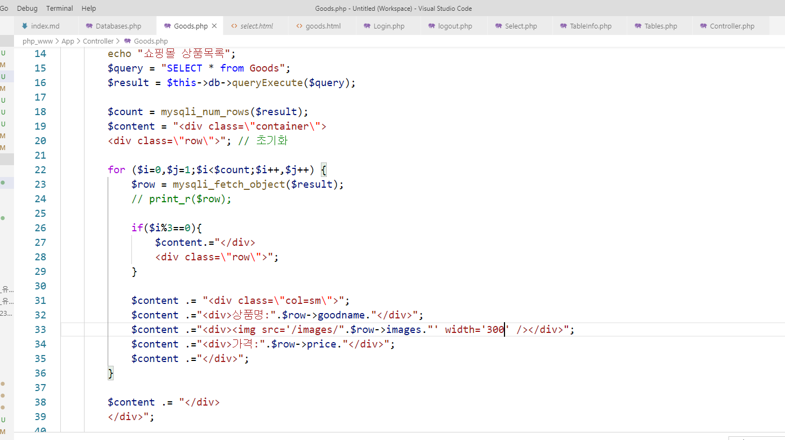
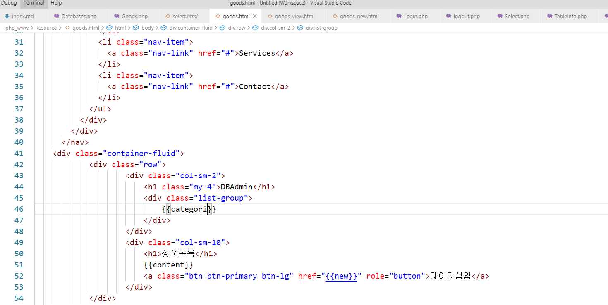
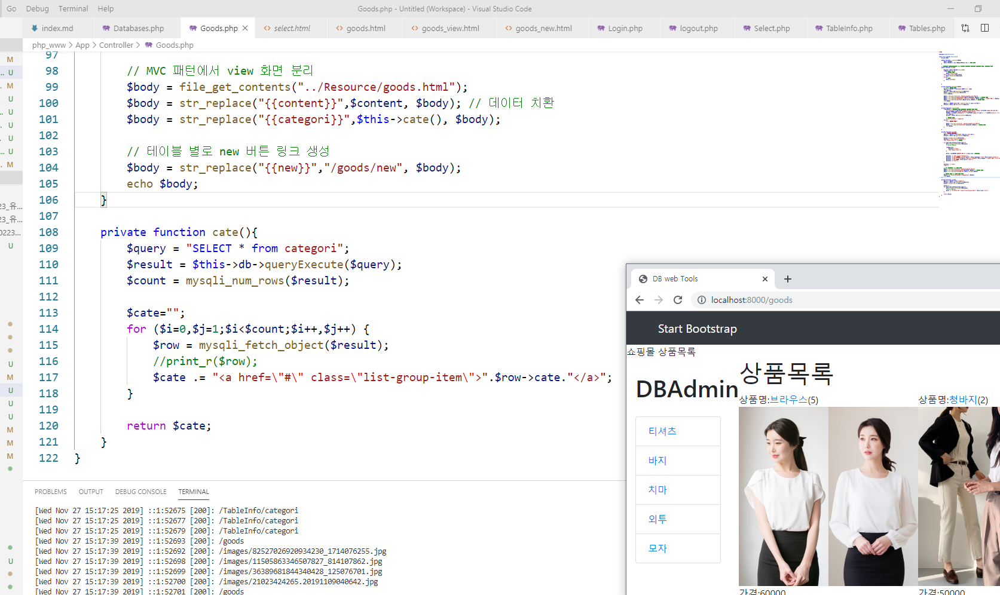

# 수업 2019.11.27
## 수업내용 정리

##### Controller.php 파일 생성후 interface 생성

##### interface는 내용이 없음, 틀만 제공

##### public으로 main메소드 생성
##### -------------------------------------------------------------------------------------------------------------------------------------
  

##### interface는 implements를 통해 상속 받음
##### -------------------------------------------------------------------------------------------------------------------------------------
  

##### Controller.php의 interface를 지우고 추상클래스를 생성

##### 주석과 같이 interface처럼 비슷하게 메소드 선언가능(앞에 추상메소드 표시인 abstract를 붙여야함)

##### hello메소드를 생성
##### -------------------------------------------------------------------------------------------------------------------------------------
  

##### 추상클래스는 extends로 상속받으며 추상클래스의 메소드를 메인메소드에서 호출
##### -------------------------------------------------------------------------------------------------------------------------------------
  

##### Goods.php를 생성후 추상클래스인 Controller를 상속받아 메인메서드 생성

##### 주석에서 설명하듯 추상클래스에서 추상메소드를 생성하였으면 상속받은 클래스에서도

##### 그 메소드를 생성 해주어야 함.
##### -------------------------------------------------------------------------------------------------------------------------------------
  

##### 다른 파일의 생성자와 쿼리부분 코드를 복사 후 Goods 테이블의 데이터가 잘나오는지 확인
##### -------------------------------------------------------------------------------------------------------------------------------------
  

##### goods.html을 생성하여 다른 html파일의 코드를 복사 후 h1태그의 문자 변경
##### -------------------------------------------------------------------------------------------------------------------------------------
  

##### Goods.php에서 데이터 정보를 출력하는 print_r을 주석처리하고

##### 주석과 같이 view화면을 분리하도록 코딩
##### -------------------------------------------------------------------------------------------------------------------------------------
  

##### for문 이전에 $content를 초기화 해주고

##### for문 안에서 $content에 입력되있던 데이터가 출력되도록 함

##### 이미지 데이터는 아직 넣지 않음
##### -------------------------------------------------------------------------------------------------------------------------------------
  

##### public 폴더안에 images 폴더를 생성하고 images 폴더안에 다운받은 파일들의 이름을

##### 각 데이터에서 수정을 해서 확장자와 함께 넣어준다.

##### 코드에서 이미지 경로는 public을 가리키고 있으므로 경로 부분에 images 폴더로 가도록 설정해준다.
##### -------------------------------------------------------------------------------------------------------------------------------------
  

##### 부트스트랩4의 grid 코드를 가져와 Goods.php에 div태그를 사용해 content에 추가해줌

##### 화면에 맞게 칸을 맞춰주는데 노트북 해상도로 인해 이미지 크기를 그대로 받으면

##### 2개까지 보여지고 다음 줄로 넘어감
##### -------------------------------------------------------------------------------------------------------------------------------------
  

##### if로 조건을 주어 한줄에 3개씩 보여지게 한다.

##### width를 300으로 주어 위에서 해상도로 인해 2개까지 보여지던걸 3개로 나오게 해준다. 
##### -------------------------------------------------------------------------------------------------------------------------------------
  

##### main에 있던 코드를 goods 메소드를 생성하여 옮겨주고

##### newInsert 메소드도 생성하여 데이터를 삽입할 때 사용한다.
##### -------------------------------------------------------------------------------------------------------------------------------------
  

##### main에는 $second에 Uri.php를 사용하도록 연결해주고

##### if조건으로 두번째 주소값이 new 라면 newInsert메소드를 가져오고

##### 아니면 목록인 goods메소드를 가져온다.
##### -------------------------------------------------------------------------------------------------------------------------------------
  

##### 버튼을 클릭하자 주소값이 goods/new가 붙었으며

##### newInsert메소드가 실행되어 데이터 삽입을 출력
##### -------------------------------------------------------------------------------------------------------------------------------------
  

##### goods.html파일을 복사하여 form부분 코드를 지우고 

##### 새로 form 코드 입력
##### -------------------------------------------------------------------------------------------------------------------------------------
  

##### newInsert메소드에 goods_new.html을 연결해줌
##### -------------------------------------------------------------------------------------------------------------------------------------
  

##### 쿼리를 추가하여 데이터를 넣는 INSERT 코드, 쿼리가 잘되는지 출력으로 확인
##### -------------------------------------------------------------------------------------------------------------------------------------
  

##### 데이터가 잘 들어가는지 값을 입력해봄
##### -------------------------------------------------------------------------------------------------------------------------------------
  

##### 잘 들어온것을 확인
##### -------------------------------------------------------------------------------------------------------------------------------------
  

##### move_uploaded_file을 사용해 삽입해준 이미지 파일을 현재 사용중인 public 폴더에 업로드해줌
##### -------------------------------------------------------------------------------------------------------------------------------------
  

##### 업로드된 사진 확인
##### -------------------------------------------------------------------------------------------------------------------------------------
  

##### 경로를 설정하여 public/images 로 가도록 설정 및 확인
##### -------------------------------------------------------------------------------------------------------------------------------------  

##### 상품명과 이미지에 $link라는 경로를 준다.

##### $link는 슈퍼변수를 사용해 주소를 받아와 순서 id 값을 받아온다.
##### -------------------------------------------------------------------------------------------------------------------------------------
  

##### 클릭 할수있게 경로가 생긴것을 확인
##### -------------------------------------------------------------------------------------------------------------------------------------
  

##### 메인에서 if문에 else를 추가해 두번째 주소값이 숫자일때를 검사한다.
##### -------------------------------------------------------------------------------------------------------------------------------------
  

##### 상품명이나 이미지를 클릭했을때 페이지를 보여주기위해

##### goods.html을 복사해서 goods_view.html을 만들어주고 원래 내용을 지우고

##### 3개의 머시태그를 추가해준다.
##### -------------------------------------------------------------------------------------------------------------------------------------
  

##### 인자값으로 $id를 받고, 쿼리를 추가하여 몇번째 이미지가 클릭되었는지 id 값을 찾는다.

##### detailView메소드에서 머시태그를 연결하여 상품명, 이미지, 가격의 데이터를 넣어준다.
##### -------------------------------------------------------------------------------------------------------------------------------------
  

##### 제대로 출력된 쿼리와 내용확인
##### -------------------------------------------------------------------------------------------------------------------------------------
  

##### 클릭 컬럼을 추가해주고 기본값으로 전부 1을 준 뒤

#####  쿼리에 수정인 UPDATE를 사용해 클릭이 발생할때마다 id값을 찾아 click컬럼의 값을 +1씩 해준다.
##### -------------------------------------------------------------------------------------------------------------------------------------
  

##### 상품명뒤에 클릭수가 나올 수 있게 수정해준다.
##### -------------------------------------------------------------------------------------------------------------------------------------
  

##### 원래 있던 목록그룹을 지워주고 머시태그를 준다.
##### -------------------------------------------------------------------------------------------------------------------------------------
  

##### cate 메소드를 만들고 categori 쿼리를 생성 실행해준다.

##### 변수 cate를 초기화 해주고, for문에서 컬럼 cate의 데이터 값을 읽어온다.

#####  그리고 goods메소드에 있는 body 변수로 goods.html의 머시태그를 cate 메소드로 

##### 치환해서 데이터를 넣어준다.
##### -------------------------------------------------------------------------------------------------------------------------------------
  

##### 이미지와 상품명,가격을 각각 6대6으로 화면비율을 나눠주고 초록색 장바구니버튼을 추가한다.
##### -------------------------------------------------------------------------------------------------------------------------------------
  

##### form태그로 버튼을 감싸주고 inputtype을 히든으로 주어 보안성을 높인다.

##### database.html에서 스크립트 코드를 가져와 버튼의 아이디와 연결해준다.

##### 클릭시에 폼의 디테일 경로로 이동하도록 한다.
##### -------------------------------------------------------------------------------------------------------------------------------------
  

##### 포스트가 존재하는지와 히든값으로준 mode를 확인하여 일치하면

##### 문자가 출력되도록 한다. 출력 확인
##### -------------------------------------------------------------------------------------------------------------------------------------
  

##### body변수에서 히든을 type으로 갖는 input에 {{id}} 머시태그를 그 창의 id값을 찾아 치환해준다.

##### 위에 if문에 쿼리를 추가하여 클릭하면 클릭된 곳에 정보를 cart 테이블로 들어가게 해준다.
##### -------------------------------------------------------------------------------------------------------------------------------------
  

##### Select.php파일의 코드를 일부 복사해서 Cart.php 를 만드는데 

##### email세션을 검사하여 일치하면 로그인 상태이며 cart 테이블을 연결한다.
##### -------------------------------------------------------------------------------------------------------------------------------------
  

##### 포스트가 존재하는지와 히든값으로준 mode를 확인하여 일치하면

##### 상품명만 id를 찾아 넣어주는것이 아니라 email값도 넣어주도록 수정
##### -------------------------------------------------------------------------------------------------------------------------------------
  

##### 이전에 생성한 Cart.php에서 email값으로 cart 테이블에서 데이터를 검색하고

#####  위에서 찾은 데이터의 id값을 이용해 goods테이블에서 데이터를 찾아 print_r로

##### id와 email 정보 그리고 상품 정보를 확인한다.
##### -------------------------------------------------------------------------------------------------------------------------------------
  