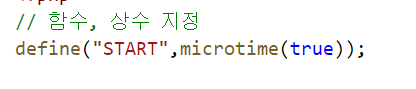
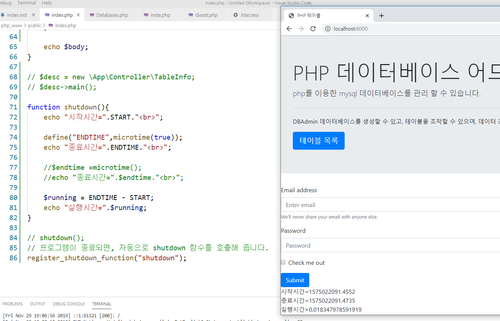

# 수업 2019.11.29
## 수업내용 정리

##### 상수로 선언하는 define으로 START를 선언해주고, 여기에 현재시간 값을 받아오는 microtime을 넣어줌 

##### 메소드 shutdown을 만들고, 이전에 선언한 상수 START를 시작시간으로 출력하고,
##### 또 상수로 ENDTIME을 선언해주며, 출력해준다.

##### 새로 변수 running을 만들고 실행시간을 넣어주기 위해 종료시간인 ENDTIME에서 시작시간인 START를

##### 빼주고 출력한다.

#####  