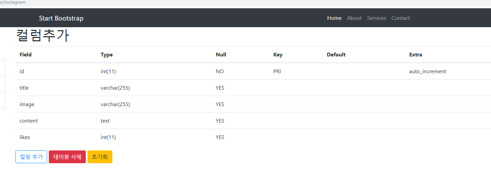

# 기말고사 2019.12.11
## 기말고사 REPORT

##### instagram의 유저 login 테이블과 글의 데이터 테이블을 생성해줍니다.

##### -------------------------------------------------------------------------------------------------------------------------------------

##### 유저 login 테이블의 컬럼입니다.

##### -------------------------------------------------------------------------------------------------------------------------------------

##### 글 데이터 테이블의 컬럼입니다.

##### -------------------------------------------------------------------------------------------------------------------------------------

##### 홈 화면으로 로그인 창입니다. 왼쪽위의 로고를 클릭하면 홈으로 갈 수 있습니다.

##### 로그인을 하지 않은 상태에서는 우측 상단의 글쓰기와 드롭다운 아이콘의 로그아웃이 작동하지 않습니다.

##### -------------------------------------------------------------------------------------------------------------------------------------

##### login 테이블에 데이터를 넣어준것을 제대로 입력하면 로그인이 되며,

##### 이전에 작성했던 글들을 볼 수 있게 됩니다. 또한 글쓰기와 드롭다운의 기능이 가능해집니다.

##### -------------------------------------------------------------------------------------------------------------------------------------

##### 글쓰기를 클릭하면 입력 내용이 나옵니다.

##### -------------------------------------------------------------------------------------------------------------------------------------

##### 글을 입력하면 글이 생성되며 목록이 보여집니다.

##### -------------------------------------------------------------------------------------------------------------------------------------

##### 클릭으로 상세페이지를 들어옵니다.

##### 내용들과 좋아요, 수정, 삭제 버튼이 보입니다.

##### -------------------------------------------------------------------------------------------------------------------------------------

##### 좋아요 버튼 클릭시 팝업창이 한 번뜨고 이미지 아래에 하트 옆의 숫자가 1씩 증가합니다.

##### -------------------------------------------------------------------------------------------------------------------------------------

##### 증가 확인

##### -------------------------------------------------------------------------------------------------------------------------------------

##### 수정 버튼을 클릭시 수정화면으로 이동하며 기존에 넣었던 데이터도 불러옵니다.

##### 위는 일부 데이터를 수정했습니다.

##### -------------------------------------------------------------------------------------------------------------------------------------

##### 데이터를 수정한 결과입니다.

##### -------------------------------------------------------------------------------------------------------------------------------------

##### 삭제 버튼 클릭시 팝업창이 뜹니다.

##### -------------------------------------------------------------------------------------------------------------------------------------

##### 리스트로 넘어가며 글이 삭제된 것을 확인할 수 있습니다.

##### -------------------------------------------------------------------------------------------------------------------------------------

##### 우측상단 드롭다운의 Log out 혹은 좌측 하단의 로그아웃을 클릭하면 로그아웃이 되며

##### 초기 로그인 창으로 이동합니다.

##### -------------------------------------------------------------------------------------------------------------------------------------

##### 교수님 한 학기 동안 열정적으로 자세히 가르쳐주셔서 정말 감사합니다!!

